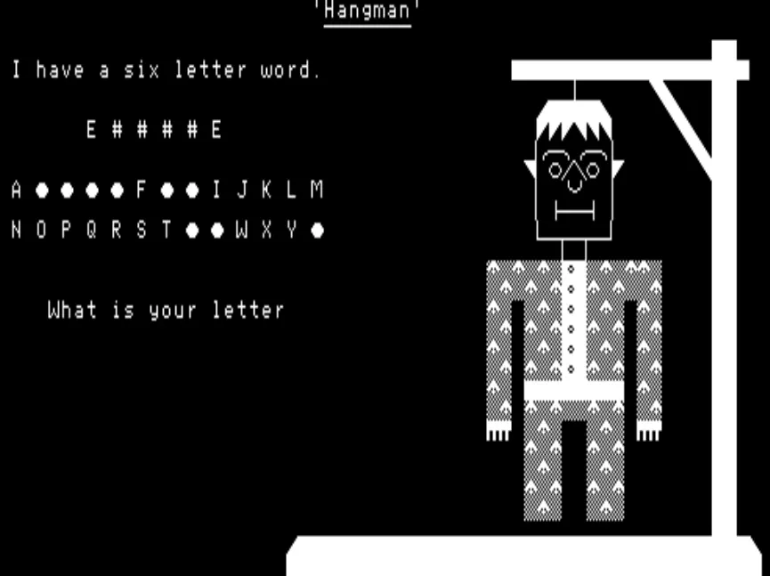

# Exidy Sorcerer 8k PacBasic With New CP/M Disk IO and Large (180 File) Legacy BASIC Program Collection

This repository was created to "market" or make more people aware of my customized "PacBasic" work of 1981 which added CP/M disk I/O commands to the stock Exidy Sorcerer 8k BASIC-in-ROM. To this very day retro-computing people still struggle to run Rom-Pac 8k BASIC programs on their real or emulated Exidy Sorcerer machines by way of data cassette file loading (which is so Neanderthal in my world!). A few dozen people had acquired my PacBasic and [TRS-80 Level II BASIC](<https://github.com/rcl9/Sorc-80--How-To-Run-TRS80-BASIC-Programs-Natively-On-The-Exidy-Sorcerer>) systems for the Exidy Sorcerer back in the 1980s but otherwise none of my work has found its way into common retro-computing archives, until now. 

<center>

</center>

This repo will bring current Exidy Sorcerer users into the 21st century with the release of these files of mine from the early 1980s:

1) My [PacBasic.com executable](/PacBasic/PacBasic.com) for CP/M which is the stock Exidy 8k BASIC-in-ROM relocated to 8000H and with my new DLOAD, DSAVE and DIR commands.

2) My personal [curated and notarized collection](</Exidy Sorcerer BASIC program collection>) of 180 Exidy 8k BASIC programs from the ~1979 to ~1982 era which run under the PacBasic.com program. 

## A Quick Overview - How to Load and Run the BASIC Programs in this Repository

1) First, you need to get the MAME emulator up and running on your computer unless you have a real Exidy Sorcerer running CP/M. I have created a good [hand's on tutorial](<https://github.com/rcl9/How-to-Set-Up-the-MAME-Emulator-for-the-Exidy-Sorcerer-Running-Dreamdisk-CPM>) explaining how to do this. 

2) Create a .mfi disk image file for MAME, or a real CP/M physical disk of your own format, then place [PacBasic.com](/PacBasic/PacBasic.com),  [PacBasic.hlp](/PacbBasic/PacBasic.hlp) and the unzipped [collection of .bas files](</Exidy Sorcerer BASIC program collection>) on one or more your CP/M disk(s), depending on its disk capacity. I have created a [tutorial](<https://github.com/rcl9/How-to-Set-Up-the-MAME-Emulator-for-the-Exidy-Sorcerer-Running-Dreamdisk-CPM>) about how to do this in a scripted manner for the MAME emulator (in the "*How to Create your own Dreamdisk Formatted .MFI Disk Images*" section).

3) Boot up your CP/M. At the CP/M prompt:

```
	B>PacBasic			--> Start up PacBasic.com (assuming that it is on your second disk B:)
	DLOAD"kaleidos.bas"	--> Load in my Kaleidoscope program
	RUN					--> Execute it (press Control-C to abort the program's execution)
```

Note: some BASIC programs in this collection will write custom machine language code to page zero (00 to FFH) as that was a common practice back in the day. However, this will overwrite the CP/M data buffers and hence corrupt any further usage of the DLOAD disk I/O command. In such cases you will need to restart CP/M and re-load PacBasic.com.

## New CP/M Commands + Technical Overview of PacBasic.com

Sorcerer standard 8k BASIC has been relocated from C000H to 8000H with new disk I/O routines residing from 7A59H to 7FFFH. It requires at least a 48k machine with CP/M located above 9D00H.  All PacBasic programs that have any machine language routines that call PacBasic ROM routines must be modified so that the addresses be relocated from C000H-DFFFH to 8000H-9FFFH. All others will work exactly the same as in Rom-Pac Basic. 

Another potential problem are programs that were saved on tape starting below 01D5H. An example would be that of a small machine language program residing at 0000H and saved as part of the basic program using the monitor SA command. This small program will have to converted to data statements and poked into zero page when the program is loaded (as I had done back in the day with all of the BASIC programs in my curated collection). Only BASIC programs starting at 01D5H can be saved on the disk. This is because CP/M‘s zero page must be intact when the disk I/O commands are used in PacBasic.

The new CP/M disk I/O commands:

	DIR"A:FILENAME.TYP"
 
		This prints the directory of drive X
		- ‘A:’ is optional
		- ‘FILENAME.TYP’ is optional
		- If you change a disk in a drive between DSAVE’s then do a ‘DIR’ to initialize that drive.
		- ‘DIR "B:"’ will print the directory of B drive
    
	DSAVE"A:FILENAME"

		This saves a basic program with filetype ‘BAS’ on disk X
		 - ‘A:’ is optional
    
	DLOAD"A:FILENAME"

		This loads a Pac-basic program of type ‘BAS’ from disk into memory.
		- ‘A:’ is optional

And some new disk I/O errors:

	FF Error
		File not found error
		- Do a ‘DIR’ to initialize the disk or check to see if the program is really on that disk.
    
	DF Error
		Disk full error
    
	 NB Error
		Not a PacBasic filetype ‘BAS’ program

Memory map:

```
	CP/M Zero Page 0000-00FF 
	BASIC work area 0100-01D5 
	BASIC text area 01D5-7A58 
	PacBasic 7A59H-9B80H
	CP/M 9D00H-BEFFH (48k)
	Exidy monitor work area: BF00H-BFFFH (48k)
```

To return to CP/M without destroying PacBasic and whatever program you have in memory, type ‘BYE’ then while in the monitor type ‘GO 0’ and the CP/M prompt should appear. If not, do a disk boot (PacBasic will still be untouched after a cold disk boot).

In CP/M you may DIR, SAVE and ERA a program. This won't destroy PacBasic. You cannot 'STAT' a program while in CP/M because it will destroy the basic program presently in memory.

To return to Basic from CP/M go to the monitor then type ‘GO 100’ and the basic will be warm started. To cold start the Basic, 'GO 8000'.

If any of the disk commands do not work, go to the monitor and cold start CP/M (such as with a 'GO D000' for DISCUS DJ2D boot or 'GO BC00' for an Exidy FDS boot), then return to the monitor again and type ‘GO 100’ to restart PacBasic. Now the commands will work. 

## My [Curated Collection](</Exidy Sorcerer BASIC program collection>) of 180 Exidy Sorcerer 8k BASIC Programs

Around 1981 I archived all of my cassette tape based software onto my CP/M 2.2 8in floppy disks and then captured those 8in disk files to my PC between 2011 and 2018.  Fast forward many more years and then I forced myself to load up each and everyone of the following BASIC programs into my PacBasic program running under the MAME emulator so that I could offer this [curated and annotated collection of files](</Exidy Sorcerer BASIC program collection>) to the retro computing community, for data preservation. Many of the files in the collection were hand typed in, ported from the PET computer, ported from the TRS-80 computer or written, by myself ("RCL9").

<center>

</center>

<p>Please feel free to mirror this page and BASIC file collection as my intent is to make this material available far and wide for others to access in the deeper future once I am no longer alive. You can attribute the material as orignally coming from "<i>Rob's Retro Computing Archive (RCL9) - https://github.com/rcl9, RetroComputingArchive@gmail.com</i>" and also reference this GitHub repository.

For those that may ask, 8k *PacBasic.com* is not the same as the 24k Exidy *exbasic.com* v5.0 Disk BASIC. The latter is Microsoft's Disk BASIC which will not run the following .bas files without error. 

Please also note: these binary .bas files are not in the standard cassette tape binary format (with an extended header of information) which are normally saved to/from cassette tape via the BASIC CLOAD/CSAVE commands. Instead they are in the format used by the PacBasic's binary file DLOAD/DSAVE disk I/O commands. Basically the first byte of the file is FFH followed by the BASIC program that itself is loaded into memory starting at 01D5H. This is an example:

```
    FF    = Header byte 

    01D5:
    0A 02     = 2 byte link pointer to the next sequential full line in the program
    01 00    = Line # 1
    8F     = "REM" statement
    20 2A 2A .... = Text string of the "REM" statement
    00    = End of line #1

    10 02    = 2 byte link pointer to the next sequential full line in the program
    02 00    = Line # 1
    8F    = "REM" statement
    00    = End of line #2

    1f 02    = 2 byte link pointer to the next sequential full line in the program
    03 00    = Line #2
    8D    = "GOSUB" statement
    etc
```

I have also used this nomenclature on some descriptions from my past notes:

	G = graphic
	V = very good
	O = Ok to play and not boring

| BASIC Filename  | Program Description      |
|:--------------- |:------------------ |
| afo16.bas       | Destroy the AFO. A converted PET game from Japan. Shoot down the UFO saucer (with graphics and some animations). Ported to Sorcerer from PET by RCL9                                                         |
| afo8.bas        | Smaller version of afo16.bas                                                                                                                                                                                 |
| alien.bas       | Alien Invaders (GV). Basic/machine language. Not too bad. Runs fairly quickly.                                                                                                                               |
| anam-art.bas    | Anamorphic Art                                                                                                                                                                                               |
| andra.bas       | Draw the letter of the alphabet using that letter itself in an enlarged manner.                                                                                                                              |
| animal1.bas     | Animal Guess #1                                                                                                                                                                                              |
| animal2.bas     | Animal Guess #2                                                                                                                                                                                              |
| armada.bas      | Space Armada (machine language). Another Space Invaders clone.                                                                                                                                               |
| atom20.bas      | A simple text based adventure game with simple prompts. Typed in from Feb 1979 Creative Computing (pg 136).                                                                                                  |
| banner.bas      |                                                                                                                                                                                                              |
| basktbal.bas    | A simulation game of Dartmouth College basketball                                                                                                                                                            |
| batcross.bas    | Battle Cross. Solitaire checker puzzle                                                                                                                                                                       |
| batleshp.bas    | The Game of Battleship                                                                                                                                                                                       |
| bgchess.bas     | Chess, 1977 by Scientific Research                                                                                                                                                                           |
| bio.bas         | Biorhythm plotter, 1979 by J.T Staley                                                                                                                                                                        |
| biorthym.bas    | Biorhythm plotter                                                                                                                                                                                            |
| bjack.bas       | Blackjack, 1979 by J.T Staley                                                                                                                                                                                |
| blackbox.bas    | Black Box by Mark Zimmerman, Feb 1980 Creative Computing (G)                                                                                                                                                 |
| blackjck.bas    | Black Jack                                                                                                                                                                                                   |
| blakjack.bas    | Black Jack by Ian Gilles for Dick Smith Electronics (GV). A graphics blackjack with splitting                                                                                                                |
| bomb.bas        | Bombardment                                                                                                                                                                                                  |
| bounce.bas      | Bounce by Creative Computing. A ball bounces around a screen                                                                                                                                                 |
| bowling.bas     | The game of bowling                                                                                                                                                                                          |
| boxing.bas      | A simulation of the game of Boxing                                                                                                                                                                           |
| brkout.bas      | Breakout, 1981 by Sapphire Software                                                                                                                                                                          |
| bunny.bas       | Bunny picture in ASCII art                                                                                                                                                                                   |
| calculat.bas    | Calc.B20 by Ken Steele and James Mazer                                                                                                                                                                       |
| calendar.bas    | Draws 12 months of the calendar                                                                                                                                                                              |
| castle1.bas     |                                                                                                                                                                                                              |
| centi2.bas      | Centipede. This is sort of a work in progress. Very slow.                                                                                                                                                    |
| chara.bas       |                                                                                                                                                                                                              |
| chase.bas       | Chase game                                                                                                                                                                                                   |
| checker2.bas    | Checkers game by Creative Computing                                                                                                                                                                          |
| checkers.bas    | Checkers game                                                                                                                                                                                                |
| chemist.bas     | Chemist game                                                                                                                                                                                                 |
| chgen.bas       | Zot's character generation aid                                                                                                                                                                               |
| chomp.bas       | The game of Chomp                                                                                                                                                                                            |
| click.bas       | Russian Roulette                                                                                                                                                                                             |
| clue.bas        | The game of CLUE                                                                                                                                                                                             |
| compucd.bas     | Compucards, 1979 by J.T. Staley. A graphical card game                                                                                                                                                       |
| corral.bas      |                                                                                                                                                                                                              |
| darts.bas       | The game of Bullseye                                                                                                                                                                                         |
| deathstr.bas    | From Oct 1978 Softside Magazine                                                                                                                                                                              |
| deepspac.bas    | A basic version of GROTNIK WARS                                                                                                                                                                              |
| demon.bas       | Something like Wumpus but you gather GOLD and points                                                                                                                                                         |
| diamond.bas     | Prints out a pretty diamond pattern                                                                                                                                                                          |
| dice.bas        | Simulates the rolling of a pair of dice.                                                                                                                                                                     |
| digclock.bas    | Digital clock by C. Boone                                                                                                                                                                                    |
| dodgem.bas      | Dodgem by Creative Computing (G)                                                                                                                                                                             |
| dptcharg.bas    | Depth Charge game                                                                                                                                                                                            |
| drlivstn.bas    | A converted Radio Shack game. Dec 1980. Ported by Paul Tan. (GV)                                                                                                                                             |
| elisa.bas       | The Elisa program of old (O)                                                                                                                                                                                 |
| esp.bas         | ESP by North American Software, Toronto Canada. 1979 by N.S. Hal                                                                                                                                             |
| fli-inst.bas    | FLISI, Program of the Sorcerer E.S.G.G user group. A simulation of a 747                                                                                                                                     |
| fli-simu.bas    | Flight Simulation, version 5, Nov 30 1980, a 747 simulator                                                                                                                                                   |
| flower.bas      | Draws flower petal shapes (G)                                                                                                                                                                                |
| fruitslt.bas    | The Sorcerer's Fruit Slot Machine (G) by David Winton                                                                                                                                                        |
| furtradr.bas    | Fur Trader game                                                                                                                                                                                              |
| gal-batl.bas    | 3D Galactic Battle                                                                                                                                                                                           |
| gal-inst.bas    | Instructions for 3D Galactic Battle                                                                                                                                                                          |
| goldadn.bas     | Lost Dutchman's Gold. July 1980 TRS-80 Softside Magazine. Entered by RCL9 Sept 1980. A converted Radio Shack program by RCL9.                                                                                |
| goldmine.bas    | Gold Mine. Typed in from Creative Computing, Dec 3 1979.                                                                                                                                                     |
| gomoko.bas      | The game of Gomoku                                                                                                                                                                                           |
| gomoko2.bas     | Gomoku (G)                                                                                                                                                                                                   |
| graphics.bas    | Graphics drawing program, 1980 by J.T. Staley                                                                                                                                                                |
| guner.bas       | Guner - A Star Wars shootout                                                                                                                                                                                 |
| hamurabi.bas    | Hammurabi from Creative Computing                                                                                                                                                                            |
| hangman1.bas    | Hangman by Colin Morle, near Liverpool (GV). A hangman game with good graphics                                                                                                                               |
| hangman2.bas    | Hangman by Duncan E. Lang, 1979                                                                                                                                                                              |
| hexapawn.bas    | The game of Hexapawn                                                                                                                                                                                         |
| hi-q.bas        | The Game of Hi-Q                                                                                                                                                                                             |
| horsrace.bas    | Greenwood Race Track Horse Race                                                                                                                                                                              |
| inkblot.bas     | A simple program to make inkblots                                                                                                                                                                            |
| kaleidos.bas    | Kaleidoscope written by RCL9, version 1 (G). It is written mostly in Z80 machine language and hence is pretty fast. It has interesting and fast 2D graphics which use my custom "Set/Reset" routine package. |
| kong.bas        | Non-functional?                                                                                                                                                                                              |
| kong2.bas       | Non-functional?                                                                                                                                                                                              |
| labrinth.bas    | Labrinth 3D maze generator (G)                                                                                                                                                                               |
| lander.bas      | Text based Lunar landing simulator                                                                                                                                                                           |
| larglett.bas    | A very simple program which generates large letters                                                                                                                                                          |
| lem.bas         | Lunar Lander. Creative Computing's lunar lander with some basic graphics                                                                                                                                     |
| letter.bas      | Large Letters                                                                                                                                                                                                |
| life-exp.bas    | Life Expectancy from "More BASIC Computer Games", pg 84. Typed in on March 2 1981.                                                                                                                           |
| life.bas        | The game of Life by Prof Conway (G)                                                                                                                                                                          |
| life3.bas       | Another game of Life                                                                                                                                                                                         |
| logic.bas       | "Logic" game by Sapphire Software, 1981                                                                                                                                                                      |
| love1.bas       | "Love" ASCII art generator                                                                                                                                                                                   |
| lunar.bas       | Lunar Lander simulator                                                                                                                                                                                       |
| madadven.bas    | Mad Adventure (GV). A converted Radio Shack game                                                                                                                                                             |
| madlib1.bas     | Mad-Lib makes interactive stories                                                                                                                                                                            |
| madlib2.bas     | Mad-Lib makes interactive stories                                                                                                                                                                            |
| mandala.bas     | Create a fancy graphic design                                                                                                                                                                                |
| masterm.bas     | Super Mastermind by Sam Cordoso from Feb 1979 Kilobaud Magazine.                                                                                                                                             |
| mastrmnd.bas    | Master-Mind in Spanish                                                                                                                                                                                       |
| maze.bas        | A very trivial 2D text maze generator                                                                                                                                                                        |
| mcombat.bas     | Giant Monster Combat by Lee Chapel, May 1980.                                                                                                                                                                |
| mcompilr.bas    | "Music Editor" by Howard Arlington, 1980 (requires D/A converter on parallel port)                                                                                                                           |
| milencnt.bas    | Military Encounter by David Ittner. 1981. A machine language game.                                                                                                                                           |
| mines.bas       | Converted from an original PET program by Colin Morle.                                                                                                                                                       |
| morse.bas       | Morse code trainer                                                                                                                                                                                           |
| mouse.bas       | Mouse Cheese Contest (G). From the July 1981 'Port FE' Toronto Sorcerer newsletter.                                                                                                                          |
| mugwump.bas     | The game of Mugwump.                                                                                                                                                                                         |
| name.bas        | A really dumb program                                                                                                                                                                                        |
| natak.bas       | "SPACE ATTACK" shooter game. Pretty slow to set up                                                                                                                                                           |
| navigate.bas    | "Nav Prog" - Some kind of aircraft navigation program                                                                                                                                                        |
| needle.bas      |                                                                                                                                                                                                              |
| nuclear.bas     | Nuclear Reaction by Creative Computing. Board game played on 6x6 matrix                                                                                                                                      |
| nuvu2.bas       | NUVU2 by G. Schaefer of the Sorcerer ESGG user group. (G)                                                                                                                                                    |
| oldtrek7.bas    | Star Trek v7 - old version?                                                                                                                                                                                  |
| onecheck.bas    | The game of One Check, a Checkers-like game                                                                                                                                                                  |
| othelo.bas      | Othelo. Typed in by RCL9, Jan 5 1980.                                                                                                                                                                        |
| pet-man.bas     | PET-MAN game by Paul Gummersall (Pacman clone but with a larger grid). Coding changes by Jim Butterfield. Ported to Sorcerer by RCL9                                                                         |
| pielob.bas      | The game of Pie Lob by Creative Computing                                                                                                                                                                    |
| pinball1.bas    | Pinball with graphics and sound                                                                                                                                                                              |
| pizza.bas       | Pizza Delivery game                                                                                                                                                                                          |
| plot1.bas       | A very simple plotter of a 3D surface                                                                                                                                                                        |
| plot2.bas       |                                                                                                                                                                                                              |
| plot3.bas       |                                                                                                                                                                                                              |
| plot4.bas       |                                                                                                                                                                                                              |
| plot5.bas       |                                                                                                                                                                                                              |
| poker.bas       | The game of Poker.                                                                                                                                                                                           |
| printat.bas     | Sorap v2.2 "Print@" routine, similar to that from the TRS-80 Level II BASIC                                                                                                                                  |
| ptest.bas       | Personality Test by J.T Staley, 1979                                                                                                                                                                         |
| quest.bas       | QUEST. An early adventure type game - from BYTE magazine                                                                                                                                                     |
| quest2.bas      | QUEST by Roger Chaffee and ported to Sorcerer by Chris McIntyre. A text adventure.                                                                                                                           |
| race.bas        | Let's Go to the Races by Alan and Jack Bajema. A very slow racing car program.                                                                                                                               |
| race7.bas       | Race Track                                                                                                                                                                                                   |
| racetrak.bas    | Race Track by R. Greenwood and D. Hague. It might need the old ROMs                                                                                                                                          |
| rally.bas       | Pitsburg to Albany Road Race, text based                                                                                                                                                                     |
| rby48.bas       | A program in Dutch + machine language which may require the old ROMs                                                                                                                                         |
| reversi.bas     | A machine language program called from BASIC                                                                                                                                                                 |
| robot.bas       | ZAP - Evade the Robots, by Jerry Morton, Feb 12 1979. (see also the newer zap.bas)                                                                                                                           |
| rocket.bas      | A pretty lame program that shows a rocket firing                                                                                                                                                             |
| roots.bas       | Find the roots of any number                                                                                                                                                                                 |
| rotate.bas      | The Game of Rotate                                                                                                                                                                                           |
| roulette.bas    | G2 Casino Roulette by Microcomputer Software Associates - semi-okay graphics                                                                                                                                 |
| rsp.bas         | Rock, Scissors & Paper by John Vachon, Computer Mart of Mass with some basic graphics                                                                                                                        |
| runner5.bas     | Some kind of game                                                                                                                                                                                            |
| salvo.bas       | Salvo by J.T Staley, 1979. A clone of Battleship.                                                                                                                                                            |
| scope.bas       | By Emiliano De Laurentiis, Montreal. A very short and simple program but which creates interesting screen patterns                                                                                           |
| seabatle.bas    | Text based sea battle (32k)                                                                                                                                                                                  |
| simon.bas       | Steve Ciarcia's SIMON music guessing game from BYTE. Requires the [hardware device](https://github.com/rcl9/Imagery-of-Past-Projects/blob/main/Hardware/1979_11%20-%20Exidy%20Sorcerer%206-bit%20music%20board.jpg) attached to the Sorcerer's parllel port.                                                                                   |
| sinewave.bas    | A very simple program that prints "CREATIVE" in a sine wave pattern                                                                                                                                          |
| slotmach.bas    | Compu-Slot Machine from the TRS-80 Softside Magazine. Ported to Sorcerer by RCL9.                                                                                                                            |
| snake.bas       | Snake game by John Palevich                                                                                                                                                                                  |
| spacgame.bas    | The Space Game from BYTE. A Star Wars X-Fighter shooter game. Typed in Feb 9 1980.                                                                                                                           |
| starbase.bas    | Starbase Hyperion by Don Urdem. Quality Software's Star Trek space game, 1980                                                                                                                                |
| startrek.bas    | Star Trek from "101 Computer Games" (32k)                                                                                                                                                                    |
| statu.bas       | STATUS game by Sapphire Software , 1981                                                                                                                                                                      |
| stockmar.bas    | Stock market simulator                                                                                                                                                                                       |
| stomp.bas       | Bug Stomper game                                                                                                                                                                                             |
| studpokr.bas    | Five Card Stud Poler. April 1980 TRS-80 Softside Magazine. Entered and converted by RCL9 Sept 1980.                                                                                                          |
| sub.bas         | Sink the Sub game by J.T. Staley, 1979                                                                                                                                                                       |
| subhunt.bas     | Submarine Hunt by G. Parkin and N. Townson, Nov 1979                                                                                                                                                         |
| sumeria.bas     | SUMER v1.3. "Government Exercise" RPG game                                                                                                                                                                   |
| surround.bas    | Surround Game by Ray Bannon, June 26 1980.                                                                                                                                                                   |
| swd&sorc.bas    | Sword and Sorcery II. An adventure game from Aug 1980 "80 Microcomputing". Typed in by Paul Tan.                                                                                                             |
| tanktrap.bas    | Tank Trap IV by Don Ursem, Quality Software, 1979                                                                                                                                                            |
| tchdwn.bas      | Touchdown - A football Simulation by J.T Staley, 1979                                                                                                                                                        |
| tflash.bas      | A demo of flashing text from the Sorcerer Port FE newsletter of Nov 1981.                                                                                                                                    |
| trek7.bas       | Star Trek II by Paul Tan. A super real time Star Trek with sound and graphics. Sound added by RCL9.                                                                                                          |
| trek76.bas      | A newer variation of trek7.bas                                                                                                                                                                               |
| trek8.bas       | Super Star Trek v8. Typed in for Sorcerer by Brian MacDonald.                                                                                                                                                |
| trivia.bas      | "Genius" geography quiz game by Creative Computing                                                                                                                                                           |
| typetutr.bas    | Sorcerer Touch-Type Tutor by R. Mercer, 1981. Unit # 1. Version 3. Machine language program.                                                                                                                 |
| typetut2.bas    | Sorcerer Touch-Type Tutor by R. Mercer, 1981. Unit # 2. Version 3. Machine language program.                                                                                                                 |
| usmap.bas       | USA map and state capital quiz by J.T. Staley, 1979                                                                                                                                                          |
| uswar.bas       | USA war game, East vs. West by Garth Dollamite, May 1979                                                                                                                                                     |
| warfish.bas     | Submarine game                                                                                                                                                                                               |
| west.bas        | Western Shootout by Colin Morle, near Liverpool. Two players shoot at each other & move around.                                                                                                              |
| western.bas     | Shoot em Up Cowboys by North American Software and N.S Hal, 1979. Has graphics.                                                                                                                              |
| wizard.bas,.doc | Wizard Castle adventure by Daniel Conway. Hunt through a 9 level castle. Entered by Paul Tan, Dec 1980.                                                                                                      |
| word1.bas       | Monster Word guessing game                                                                                                                                                                                   |
| wordsrch.bas    | Word search puzzle. Typed in on Dec 8 1979.                                                                                                                                                                  |
| wrdsrc2.bas     | Puzzle by Leor Zolman for Creative Computing, Dec 1978. Creates a word search puzzle.                                                                                                                        |
| wumpus.bas      | Wumpus II. Explore different caves.                                                                                                                                                                          |
| x-and-o.bas     | A very simple text-based version of Tic Tac Toe.                                                                                                                                                             |
| xand0.bas       | X & O by J.T and R.P Stanley, 1979                                                                                                                                                                           |
| xmaspic.bas     | Draws a Christmas Eve scene with a Xmas tree and a window                                                                                                                                                    |
| zap.bas         | ZAP - Evade the Robots, by Jerry Morton, Feb 12 1979. (see also the older robot.bas version)                                                                                                                 |

## Other Sources of Exidy Sorcerer Software

[Terry Stewart's collection](https://www.classic-computers.org.nz/blog/2017-01-23-software-for-real-sorcerers.htm) of files in .wav audio format. Use my "[convert.btm](<https://github.com/rcl9/How_To_Archive_Old_Computer_Data_Tapes_Using_Tapetool2>)" file to convert them to binary files. Note: the resulting .bas files will not be immediately compatible to my PacBasic.com due to the explanation earlier in this repo overview.

[Year-Based collection of games for the Exidy Sorcerer v1.0](https://archive.org/details/year-based-collection-of-games-for-the-exidy-sorcerer-v-1.0) - these are in the data cassette .tape format which is not compatible with the binary PacBasic methods I outlined in this repo. Instead, just rely on my collection of files provided in this repo or those from Terry Stewart's original collection.

[John Halk's Sorcerer File Repository & Forum](https://exidysorcerer.net). You should also visit the corresponding [forum](https://www.exidysorcerer.net/index.html)

[Exidy Sorcerer](https://www.microbee-mspp.org/repository) section of the Microbee file respository. Log into the "retro" archive then navigate to the "Vintage / Exidy Sorcerer" sub-directory.
